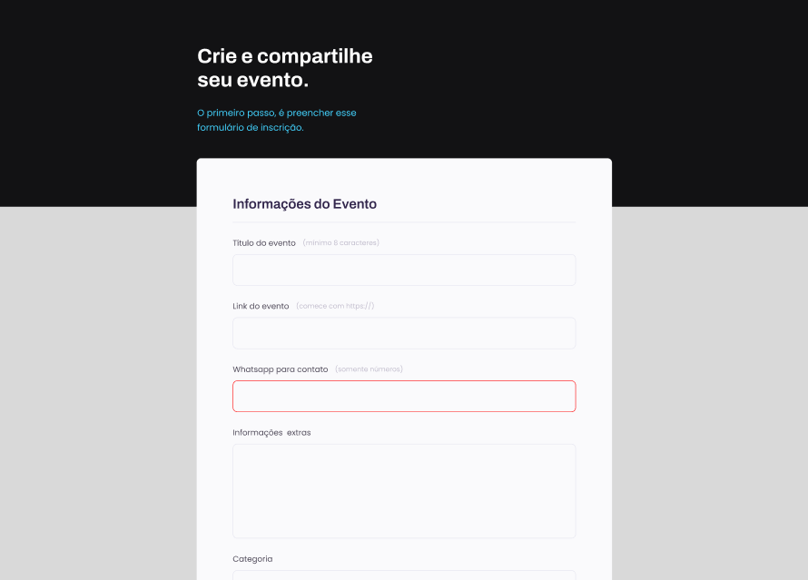

<h1 align="center"> Projeto Formulário de Eventos </h1>

Programa exclusivo promovido pela Rocketseat para ensino de tecnologias WEB.

  <a href="#-tecnologias">Tecnologias</a>&nbsp;&nbsp;&nbsp;|&nbsp;&nbsp;&nbsp;
  <a href="#-projeto">Projeto</a>&nbsp;&nbsp;&nbsp;|&nbsp;&nbsp;&nbsp;
  <a href="#-layout">Layout</a>&nbsp;&nbsp;&nbsp;|&nbsp;&nbsp;&nbsp;
  <a href="#memo-licença">Licença</a>

  

 

  

## 🚀 Tecnologias

Esse projeto foi desenvolvido com as seguintes tecnologias:

- HTML e CSS
- Git e Github
- Figma

## 💻 Projeto

O projeto Formulário de Eventos é uma pagina simples, para treino de HTML e CSS.

## 🔖 Layout

Você pode visualizar o layout do projeto através [DESSE LINK](<https://www.figma.com/file/erGuJnVSpufoOuwMuYWM4Q/Explorer-Stage-03-Projeto-01-(Copy)?type=design&node-id=0-1&mode=design&t=90xCo1UnBJGgqy8t-0>). É necessário ter conta no [Figma](https://figma.com) para acessá-lo.

## :memo: Licença

Esse projeto está sob a licença MIT.

---

Feito com ♥ by Rocketseat :wave: [Participe da nossa comunidade!](https://discord.gg/rocketseat)
